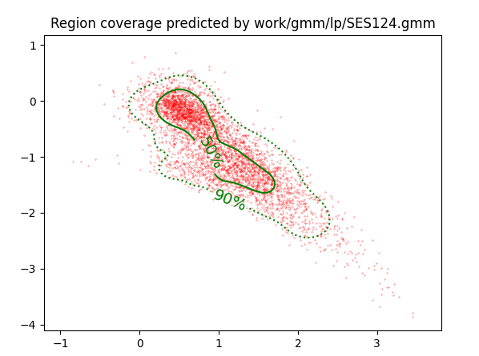
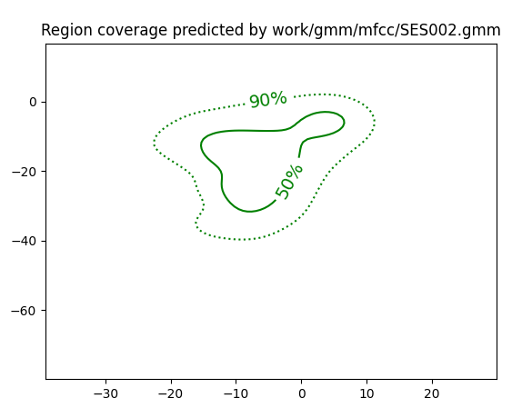

PAV - P4: reconocimiento y verificación del locutor
===================================================

Obtenga su copia del repositorio de la práctica accediendo a [Práctica 4](https://github.com/albino-pav/P4)
y pulsando sobre el botón `Fork` situado en la esquina superior derecha. A continuación, siga las
instrucciones de la [Práctica 2](https://github.com/albino-pav/P2) para crear una rama con el apellido de
los integrantes del grupo de prácticas, dar de alta al resto de integrantes como colaboradores del proyecto
y crear la copias locales del repositorio.

También debe descomprimir, en el directorio `PAV/P4`, el fichero [db_8mu.tgz](https://atenea.upc.edu/mod/resource/view.php?id=3654387?forcedownload=1)
con la base de datos oral que se utilizará en la parte experimental de la práctica.

Como entrega deberá realizar un *pull request* con el contenido de su copia del repositorio. Recuerde
que los ficheros entregados deberán estar en condiciones de ser ejecutados con sólo ejecutar:

~~~~~~~~~~~~~~~~~~~~~~~~~~~~~~~~~~~~~~~~~~~~~~~~~~~~~.sh
  make release
  run_spkid mfcc train test classerr verify verifyerr
~~~~~~~~~~~~~~~~~~~~~~~~~~~~~~~~~~~~~~~~~~~~~~~~~~~~~

Recuerde que, además de los trabajos indicados en esta parte básica, también deberá realizar un proyecto
de ampliación, del cual deberá subir una memoria explicativa a Atenea y los ficheros correspondientes al
repositorio de la práctica.

A modo de memoria de la parte básica, complete, en este mismo documento y usando el formato *markdown*, los
ejercicios indicados.

## Ejercicios.

### SPTK, Sox y los scripts de extracción de características.

- Analice el script `wav2lp.sh` y explique la misión de los distintos comandos involucrados en el *pipeline*
  principal (`sox`, `$X2X`, `$FRAME`, `$WINDOW` y `$LPC`). Explique el significado de cada una de las 
  opciones empleadas y de sus valores.

  sox: sirve para realizar multiples tareas con ficheros de audio, como cambiar el formato, realizar operaciones de procesado de señal como transformadas o reducción de ruido.
    * -t : Tipo de fichero de audio. Nosotros usamos raw.
    * -e: Indicamos la codificación que queremos aplicar al fichero, en nuestro caso "signed".
    * b: Número de bits, usamos 16 bits. 
    * -: Redirección del output, es decir la pipeline

  $X2X : permite la conversión entre distintos formatos datos.
    * +sf : Pasamos de un formato a otro. Es decir de s (short - 2 bytes) a f (float - 4 bytes).

  $FRAME : sirve para extraer frame a frame toda una secuencia. Nosotros cogemos tramas de longitud 240 (-l 240) y con un periodo de 80 (-p 80).
    * -l : Número de muestras de cada trama. Como se puede ver usamos 240 muestras, lo que equivale a 30 ms (fm = 8000 Hz). 
    * -p : Número de muestras de desplazamiento, usamos 80 muestras lo que equivale a 10 ms de desplazamiento entre ventanas.

  $WINDOW : sirve para enventanar los datos.
    * -l : Tamaño de la ventana de entrada, es decir las 240 muestras de cada trama, configurado previamente.
    * -L : Tamaño de la ventana de salida, mantenemos las 240 muestras.

  $LPC : sirve para calcular los coeficientes LPC mediante el métodoLevinson-Durbin
    * -l : Tamaño de la ventana, en nuestro caso 240 muestras.
    * -m : Número de coeficientes LPC que queremos, lo determinamos en base a su orden

- Explique el procedimiento seguido para obtener un fichero de formato *fmatrix* a partir de los ficheros de
  salida de SPTK (líneas 45 a 51 del script `wav2lp.sh`).

  Para generar el archivo en formato fmatrix, es fundamental conocer la cantidad de filas y columnas de la matriz. Para determinar el número de columnas, simplemente necesitamos conocer el orden de predicción y agregarle 1, ya que el primer valor corresponde a la ganancia, la cual no se incluye en los coeficientes LPC.

  Por otro lado, para obtener el número de filas, utilizaremos un comando en Perl. Inicialmente, disponemos de un conjunto de números flotantes de 4 bytes. Para poder calcular el número de filas, transformamos estos números a formato ASCII, generando un archivo donde cada valor ASCII se encuentra en una fila individual. Luego, empleamos el comando "wc -l" para contar el número de filas en este archivo.

  * ¿Por qué es más conveniente el formato *fmatrix* que el SPTK?

   Este formato nos brinda la ventaja de organizar los datos de manera más estructurada, permitiendo que las señales estén ordenadas y caracterizadas por tramas y coeficientes. En otras palabras, cada fila de la matriz representa una trama de la señal, mientras que cada columna corresponde a un coeficiente que hemos utilizado para parametrizar dicha trama. 
   
   Es importante resaltar que, gracias al uso de matrices, podemos seleccionar y manipular fácilmente las filas y columnas de interés mediante el uso del comando "cut". Esta funcionalidad es especialmente útil cuando necesitamos aislar partes específicas de los datos para un análisis más detallado o para realizar operaciones específicas sobre ciertas secciones de la matriz.

- Escriba el *pipeline* principal usado para calcular los coeficientes cepstrales de predicción lineal
  (LPCC) en su fichero <code>scripts/wav2lpcc.sh</code>:

  

- Escriba el *pipeline* principal usado para calcular los coeficientes cepstrales en escala Mel (MFCC) en su
  fichero <code>scripts/wav2mfcc.sh</code>:

  

### Extracción de características.

- Inserte una imagen mostrando la dependencia entre los coeficientes 2 y 3 de las tres parametrizaciones
  para todas las señales de un locutor.
  
  + Indique **todas** las órdenes necesarias para obtener las gráficas a partir de las señales 
    parametrizadas.
    
    -LP:
    
    

    -LPCC:
    
    

    -MFCC:
    
    

  + ¿Cuál de ellas le parece que contiene más información?

  Las gráficas del lpcc y mfcc están mucho menos correladas que las del lp. Esto hace que cada valor sea menos predecible que para la paremtrización lp y por lo tanto aportan mas información.

- Usando el programa <code>pearson</code>, obtenga los coeficientes de correlación normalizada entre los
  parámetros 2 y 3 para un locutor, y rellene la tabla siguiente con los valores obtenidos.

  |                        | LP   | LPCC | MFCC |
  |------------------------|:----:|:----:|:----:|
  | &rho;x[2,3] |-0.708|0.256 |0.409 |
  
  + Compare los resultados de <code>pearson</code> con los obtenidos gráficamente.

   &rho;x[2,3] indica que cuanto mas cerca esté un valor del +-1 mas correlados están los coeficientes 2 y 3 de la paremtrización que estemos evaluando. En este caso podemos ver como como el mas cercano al |1| es el LP, luego el MFCC y después el LPCC. Coincide con lo apreciado en las gráficas por lo tanto los resultados del pearson son concordantes.
  
- Según la teoría, ¿qué parámetros considera adecuados para el cálculo de los coeficientes LPCC y MFCC?

LPCC y MFCC suelen tener unos 13 coeficientes. Además el MFCC usa entre 24 y 40 filtros.

### Entrenamiento y visualización de los GMM.

Complete el código necesario para entrenar modelos GMM.

- Inserte una gráfica que muestre la función de densidad de probabilidad modelada por el GMM de un locutor
  para sus dos primeros coeficientes de MFCC.

  

- Inserte una gráfica que permita comparar los modelos y poblaciones de dos locutores distintos (la gŕafica
  de la página 20 del enunciado puede servirle de referencia del resultado deseado). Analice la capacidad
  del modelado GMM para diferenciar las señales de uno y otro.

  -Gráfica del locutor correcto (SES002):
  

  -Gráfica del locutor erróneo (SES124):
  

  Se puede ver como para el locutor correcto la forma de la función de densidad de probabilidad de las GMM se adapta mas a las muestras que para un locutor erróneo.

### Reconocimiento del locutor.

Complete el código necesario para realizar reconociminto del locutor y optimice sus parámetros.

- Inserte una tabla con la tasa de error obtenida en el reconocimiento de los locutores de la base de datos
  SPEECON usando su mejor sistema de reconocimiento para los parámetros LP, LPCC y MFCC.

  -LP
  

  -LPCC
  

  -MFCC
  

### Verificación del locutor.

Complete el código necesario para realizar verificación del locutor y optimice sus parámetros.

- Inserte una tabla con el *score* obtenido con su mejor sistema de verificación del locutor en la tarea
  de verificación de SPEECON. La tabla debe incluir el umbral óptimo, el número de falsas alarmas y de
  pérdidas, y el score obtenido usando la parametrización que mejor resultado le hubiera dado en la tarea
  de reconocimiento.

  -LP
  

  -LPCC
  

  -MFCC
  
 
### Test final

- Adjunte, en el repositorio de la práctica, los ficheros `class_test.log` y `verif_test.log` 
  correspondientes a la evaluación *ciega* final.

### Trabajo de ampliación.

- Recuerde enviar a Atenea un fichero en formato zip o tgz con la memoria (en formato PDF) con el trabajo 
  realizado como ampliación, así como los ficheros `class_ampl.log` y/o `verif_ampl.log`, obtenidos como 
  resultado del mismo.
